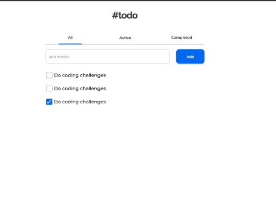
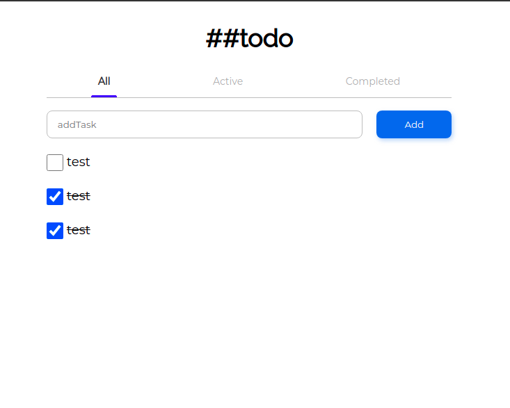

## Para visualizar o site utilize: https://godinhojoao.github.io/todo-list/

<table>
  <tr>
    <th>Desafio</th>
    <th>Resultado</th>
  </tr>
  <tr>
    <td>
      
    </td>
    <td>
      
    </td>
  </tr>
</table>

# Sobre o site

- link do desafio : https://devchallenges.io/challenges/hH6PbOHBdPm6otzw2De5
- Todo list com filtragem de tasks, opção de remoção apenas se a task ja estiver completa, entre outras coisas.

# Para rodar o projeto na sua máquina:

- git clone https://github.com/godinhojoao/todo-list
- abra o index.html da forma que preferir, seja diretamente pela file, ou até mesmo utilizando algum plugin ou biblioteca.
